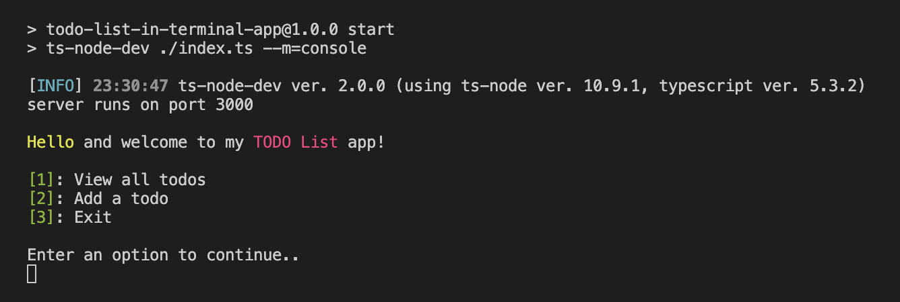

# TodoList in Web Terminal

## Overview

This project is a TodoList application that offers two modes of interaction: Web Mode and Console Mode. It is built using Node.js, Express, TypeScript, xterm.js, Socket.IO, and ESM modules.

###### Web Mode 

###### Console Mode

## Features

### Web Mode

- Interactive terminal in a web page
- WebSocket communication with the Node.js backend
- Real-time synchronization of todos
- User-friendly interface for managing todos

### Console Mode

- Run the application in the console
- Node.js prompts for managing todos
- Simple and efficient interaction with the TodoList

## Usage

The application can be run in either Web Mode or Console Mode, depending on the provided `mode` argument.

### Web Mode

1. Make sure Node.js is installed on your machine.
2. Install dependencies: `npm install`
3. Run the application in Web Mode: `npm start -- --mode=web`, or just `npm start`
4. Open your web browser and navigate to `http://localhost:3000`

### Console Mode

1. Make sure Node.js is installed on your machine.
2. Install dependencies: `npm install`
3. Run the application in Console Mode: `npm start -- --mode=console`
4. Follow the prompts in the console to manage your todos.

## Technologies Used

- Node.js
- Express
- TypeScript
- xterm.js
- Socket.IO
- ESM Modules

## Installation

1. Clone the repository: `git clone https://github.com/your-username/todo-list-web-terminal.git`
2. Navigate to the project directory: `cd todo-list-web-terminal`
3. Install dependencies: `npm install`

## Configuration

No additional configuration is required. The application is set up to work seamlessly in both Web Mode and Console Mode.

## License

This project is licensed under the [MIT License](LICENSE).
